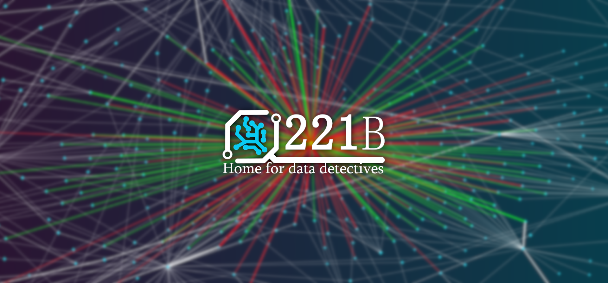
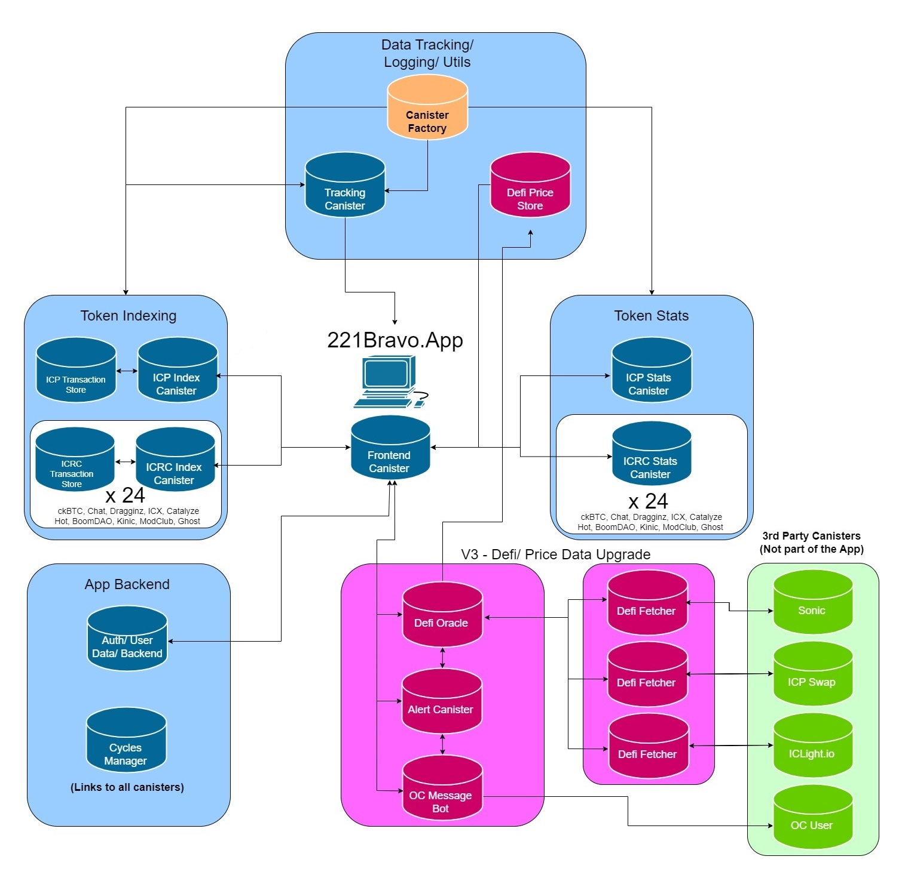

# 221BravoApp V3
[221Bravo](https://221bravo.app) is a blockchain explorer primarily focused on the Internet Computer Ecosystem giving users the ability to navigate complex data in a simple and understandable way. 

Unlike most other blockchain explorers, 221Bravo runs entirely on the [ICP Blockchain](https://internetcomputer.org/docs/current/home) and is powered by over 100 smart contracts. 

### Features
221Bravo App is compatible with ICP and all SNS (ICRC) tokens. 

- Overview of top ICP tokens and simple account searching tool on the [homepage](https://221bravo.app)
- Token price charts and stats (top holders, volumes, whale moves) [example](https://221bravo.app/stats/CKBTC)
- Account searching via URL parameters /account/[ TICKER ]?id=[ ACCOUNT ] [example](https://221bravo.app/account/ICP?id=ab8f382fdce7c5cbc951c895f815325cdfdd9fc50116752081613715c333737b)
- Block/ transaction explorer tool [example](https://221bravo.app/blocks/icp)
- Block searching via URL parameters /blocks/[ TICKER ]?start=[ BLOCK NUMBER ]&end=[ BLOCK NUMBER ] [example](https://221bravo.app/blocks/cketh?start=0&end=10)
- Named Accounts
- Price Alerts
- [Members chat](https://oc.app/community/vrtdr-dyaaa-aaaar-a2exq-cai/channel/283806532254715438641103320620325336219) (by OpenChat) 

## Architecture 

 
